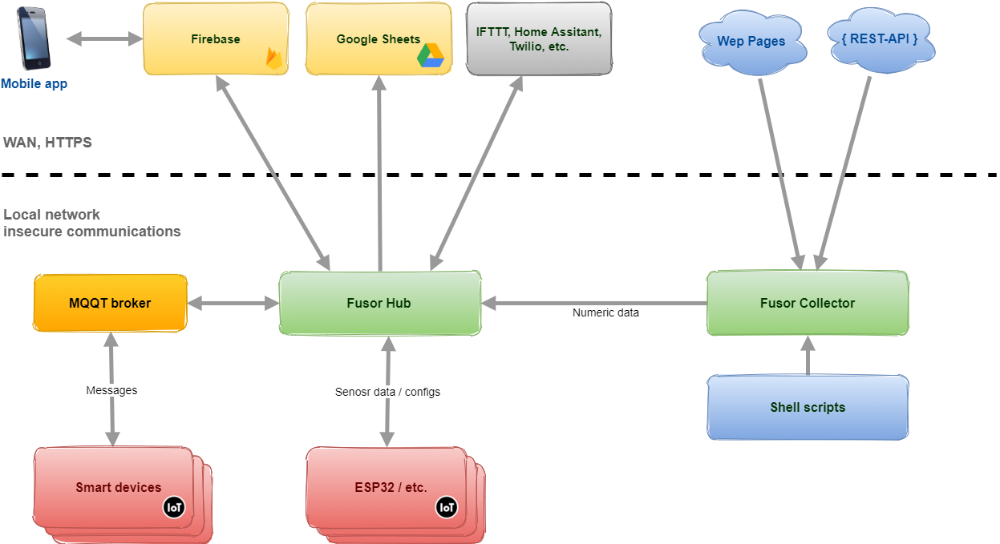

## What is it?

Fusor is a framework for Smart House enthusiasts simplifying development of custom IOT nodes and letting to focus on code logic. 
Fusor hub is the central component connecting all pieces together.

## Big picture



## Installation

```bash
$ npm i
$ npm i -g pm2
```

## Before running app

1. Rename .env.default to .env and update settings if needed

2. Register for Firebase and get configuration .json file, see: https://firebase.google.com/docs/admin/setup
   Configuration file should be save as ./firebase-config.json in project root folder

## Running the app

```bash
# development
$ npm run start

# watch mode
$ npm run start:dev

# production mode
$ npm run start:prod
```

## Test

```bash
# unit tests
$ npm run test

# e2e tests
$ npm run test:e2e

# test coverage
$ npm run test:cov
```
